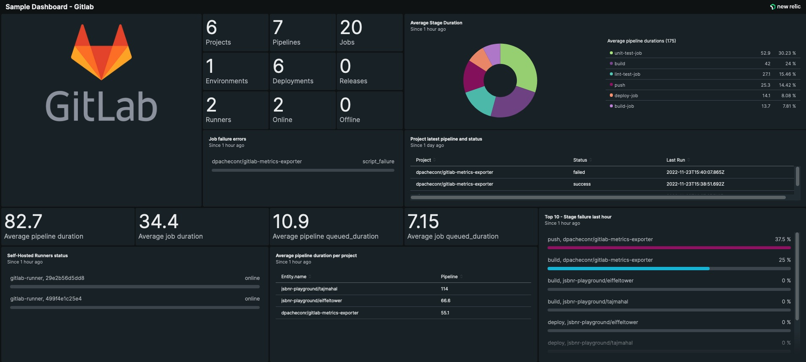

# BETA: New Relic Gitlab Exporters
>Monitor Gitlab with OpenTelemetry and New Relic quickstarts

## How to monitor Gitlab with New Relic

Now, you can monitor your Gitlab data with New Relic using New Relic Exporter and Metrics Exporter, making it easier to get observability into your CI/CD pipeline health and performance.

Using these exporters you will be able to:

- Visualise key metrics on your Gitlab pipelines, such as how long your jobs are taking, how often they are failing
- Visualise jobs and pipeline executions as distributed traces with logs in context 
- Pinpoint where issues are coming from in your pipelines.
- Create alerts on your Gitlab pipelines.

The next image shows a New Relic dashboard with some of the Gitlab metrics you’ll be able to visualise.

## Gitlab Dashboard

# New Relic Exporter

| Variables | Description | Optional | Values | Default |
| ---       |         --- |       ---| ---    |   ----   |
| `OTEL_EXPORTER_OTEL_ENDPOINT` | New Relic OTEL endpoint including port | True | String | "https://otlp.nr-data.net:4318" or "https://otlp.eu01.nr-data.net:4318" |
| `GLAB_TOKEN` | MASKED - Token to access gitlab API | False | String | None |
| `NEW_RELIC_API_KEY` | MASKED - New Relic License Key | False | String | None |
| `GLAB_EXPORT_LOGS` | Export job logs to New Relic | True | Boolean | True |
| `GLAB_ENDPOINT` | Gitlab API endpoint | True | String | "https://gitlab.com" |

# New Relic Metrics Exporter
    GLAB_PROJECT_OWNERSHIP=True
    GLAB_PROJECT_VISIBILITY="private"
| Variables | Description | Optional | Values | Default |
| ---       |         --- |       ---| ---    |   ----   |
| `OTEL_EXPORTER_OTEL_ENDPOINT` | New Relic OTEL endpoint including port | True | String | "https://otlp.nr-data.net:4318" or "https://otlp.eu01.nr-data.net:4318" |
| `GLAB_ENDPOINT` | Gitlab API endpoint | True | String | "https://gitlab.com" |
| `GLAB_TOKEN` | MASKED - Token to access gitlab API | False | String | None |
| `NEW_RELIC_API_KEY` | MASKED - New Relic License Key | False | String | None |
| `GLAB_PROJECT_OWNERSHIP` | Project ownership | False | String | True |
| `GLAB_PROJECT_VISIBILITY` | Project visibility | False | String | private |
| `GLAB_EXPORT_PATHS` | Project paths aka namespace full_path to obtain data from | False | List* | None if running as standalone or CI_PROJECT_ROOT_NAMESPACE if running as pipeline schedule|
| `GLAB_EXPORT_PROJECTS_REGEX` | Regex to match project names against “.*” for all | False | Boolean | None |
| `GLAB_EXPORT_LAST_MINUTES` | The amount past minutes to export data from | True | Integer | 60 |
| `GLAB_ATTRIBUTES_DROP` | Attributes to drop from logs and spans events | True | List* | None |
| `GLAB_DIMENSION_METRICS` | Extra dimensional metric attributes to add to each metric | True | List* | NONE Note the following attributes will always be set as dimensions regardless of this setting: status,stage,name |
| `GLAB_STANDALONE` | Set to True if not running as gitlab pipeline schedule | True | Boolean | False |
| `GLAB_ENVS_DROP` | Extra system environment variables to drop from span attributes | True | List* | Note the following environment variables will always be dropped regardless of this setting: NEW_RELIC_API_KEY,GITLAB_FEATURES,CI_SERVER_TLS_CA_FILE,CI_RUNNER_TAGS,CI_JOB_JWT,CI_JOB_JWT_V1,CI_JOB_JWT_V2,GLAB_TOKEN,GIT_ASKPASS,CI_COMMIT_BEFORE_SHA,CI_BUILD_TOKEN,CI_DEPENDENCY_PROXY_PASSWORD,CI_RUNNER_SHORT_TOKEN,CI_BUILD_BEFORE_SHA,CI_BEFORE_SHA,OTEL_EXPORTER_OTEL_ENDPOINT,GLAB_DIMENSION_METRICS |
*comma separated

## New Relic Quickstart
> https://newrelic.com/instant-observability/gitlab

## How to 

> https://newrelic.com/blog/how-to-relic/monitor-gitlab-with-opentelemetry

Alternative to running new relic metrics exporter as pipeline schedule:
Rather than running in a GitLab pipeline the New Relic Metrics exporter can also  be run independently enabling standalone mode. To run in Docker for instance run the following:
 
docker run -e GLAB_STANDALONE=True -e GLAB_EXPORT_GROUPS_REGEX=".*" -e GLAB_EXPORT_PROJECTS_REGEX=".*" -e GLAB_TOKEN=glpat.... -e NEW_RELIC_API_KEY=....NRAL docker.io/dpacheconr/gitlab-metrics-exporter:1.0.0

## Contributing

We encourage your contributions to improve [Gitlab Exporters](../../)! Keep in mind when you submit your pull request, you'll need to sign the CLA via the click-through using CLA-Assistant. You only have to sign the CLA one time per project. If you have any questions, or to execute our corporate CLA, required if your contribution is on behalf of a company, please drop us an email at opensource@newrelic.com.

**A note about vulnerabilities**

As noted in our [security policy](../../security/policy), New Relic is committed to the privacy and security of our customers and their data. We believe that providing coordinated disclosure by security researchers and engaging with the security community are important means to achieve our security goals.

If you believe you have found a security vulnerability in this project or any of New Relic's products or websites, we welcome and greatly appreciate you reporting it to New Relic through [HackerOne](https://hackerone.com/newrelic).

## License

Gitlab Exporters are licensed under the [Apache 2.0](http://apache.org/licenses/LICENSE-2.0.txt) License.

>Gitlab Exporters also use source code from third-party libraries. You can find full details on which libraries are used and the terms under which they are licensed in the third-party notices document.

